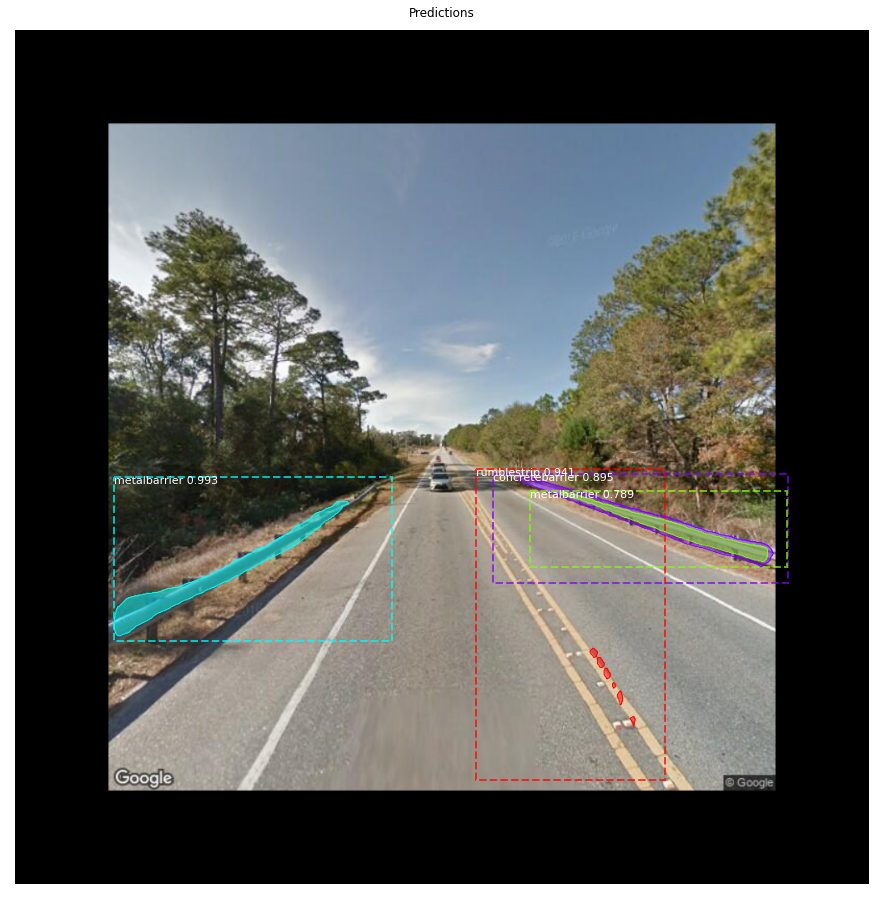

# Retraining using MaskRCNN

This project retrains a pretrained MaskRCNN model on a new dataset. By default, it retrains a model pretrained on the COCO dataset.

For an overview of MaskRCNN, refer to [this article](https://www.analyticsvidhya.com/blog/2019/07/computer-vision-implementing-mask-r-cnn-image-segmentation/). For a more detailed analysis, you can read the [MaskRCNN paper](https://arxiv.org/abs/1703.06870).

This project uses the [matterport/Mask_RCNN](https://github.com/matterport/Mask_RCNN) implementation of MaskRCNN. The implementation makes it fairly simple to load a new dataset and begin the retraining process.

This project uses Python 3.6 and tensorflow 1.3.0 / tensorflow-gpu 1.15.0. For a full list of dependencies, please refer to the [Pipfile](./Pipfile).

The project performs the following steps:
1. Creates a config class for retraining (see [MaskRCNNConfig.py](MaskRCNNConfig.py))
2. Loads and prepares the training and validation datasets based on the 
    input path provided (see [RoadBarrierDataset.py](./RoadBarrierDataset.py))
3. Loads a MaskRCNN model using the weights specified
4. Retrains the MaskRCNN model on the new training/validation datasets
5. Displays the results of the best model (best validation loss) performing 
    inference on the validation set

## Setup

1. Clone the [Mask_RCNN](https://github.com/matterport/Mask_RCNN) repo

    `git clone --quiet https://github.com/matterport/Mask_RCNN.git`

2. Get pretrained maskrcnn weights (in this case, pretrained on the COCO dataset)

    `wget https://github.com/matterport/Mask_RCNN/releases/download/v2.0/mask_rcnn_coco.h5`

3. Install dependencies from pipenv

    `pipenv install` or `python -m pipenv install`

4. Enter pipenv

    `pipenv shell` or `python -m pipenv shell`

5. Install maskrcnn

    ```
    cd Mask_RCNN
    python setup.py install
    cd ..
    ```

## Usage

Proper usage: `python main.py [-f ./path/to/data] [-w ./path/to/checkpoint] [-e num_epochs] [-v] [-d] [-h] [-i] [-e]`

* **-f** or **--files**: The path to the training and validation data (see images/README for proper format)
* **-w** or **--weights**: The path to the checkpoint you would like to begin at. The default is mask_rcnn_coco.h5.
* **-e** or **--epochs**: The number of epochs to retrain on; default is 10
* **-v**: "verbose"; prints out more things...
* **-d**: "display"; displays the validation images and ground truths when they are loaded
* **-h**: displays a help message detailing how to run the program
* **-i**: "inference"; only run inference using the model specified with -w (no retraining)

Example usage:

* Retrain on the images/ dataset starting with the default pretrained weights (mask_rcnn_coco.h5):

    ```
    python main.py -f ./images
    ```
* Retrain on the images/ dataset using weights you've already started training

    ```
    python main.py -f ./images -w ./retrained_models/best_val.time.h5
    ```
* Retrain over 30 epochs instead of the default (10)

    ```
    python main.py -e 30
    ```
* Run inference (no retraining) using a model you have already trained
    ```
    python main.py -i -w ./retrained_models/best_val.time.h5
    ```

## Data Format

See [images/README.md](./images/README.md) for a description of the proper dataset format.

## Example Code

There are two example code walkthroughs. The first exists as a Colab notebook: [MaskRCNN_Road_Barriers.ipynb](MaskRCNN_Road_Barriers.ipynb). The second can be found further in this section.

Both of these examples require the usage of the [Road Barriers Dataset](https://drive.google.com/drive/folders/10L-YCj88Z7RIraDdgCMoCgSH-pAHYLcL?usp=sharing) which contains about 70 annotated images of different "road barriers" found in Google Maps images. The 3 categories in the dataset are "concretebarrier", "metalbarrier", and "rumblestrip". These categories correspond to different kinds of barriers commonly found on the sides of roads.

1. Colab

    The Colab walkthrough is fairly straightforward. Further instructions can be found in the [notebooks README](./notebooks/README.md).

2. Python Project

    To run this project as a Python project, perform the following steps:

    1. Download the road barriers dataset from this link: [Road Barriers Dataset](https://drive.google.com/drive/folders/10L-YCj88Z7RIraDdgCMoCgSH-pAHYLcL?usp=sharing).

    2. Unzip and move the dataset into this repository. Its structure should look like this:

        ```
        MaskRCNNRetraining/
            road-block-images/
                train/
                    images/
                    annotations.json
                val/
                    images/
                    annotations.json
        ```

    3. If you haven't already, follow the [Setup](##Setup) instructions.

    4. Run main.py to retrain the downloaded *mask_rcnn_coco.h5* on the new dataset:

        `python main.py`

        * For more details on how to run the project/other use cases, refer to [Usage](##Usage)

## File and folder Explanations

### main.py

This file is the main entrypoint of the program. It performs the following steps:
1. Creates a config class for retraining (see MaskRCNNConfig.py)
2. Loads and prepares the training and validation datasets based on the 
    input path provided
3. Loads a MaskRCNN model using the weights specified
4. Retrains the MaskRCNN model on the new training/validation datasets
5. Displays the results of the best model (best validation loss) performing 
    inference on the validation set

### MaskRCNNConfig.py

This file extends the [matterport/Mask_RCNN Config class](https://github.com/matterport/Mask_RCNN/blob/master/mrcnn/config.py). It defines the retraining hyperparameters such as learning rate, the number of classes, and steps per epoch. The number of gpus/images per gpu can also be configured here.

### RoadBarrierDataset.py

This file describes how to load the dataset's images and ground truth annotations into memory. It extends the [matterport/Mask_RCNN Config class](https://github.com/matterport/Mask_RCNN/blob/master/mrcnn/utils.py). Changing this to a different dataset is trivial. Simply modify the `self.add_class()` functions as well as the mapping from class name to category id found in `category_to_id`.

### [utils/visualize.py](./utils/visualize.py)

This file visualizes either the ground truth annotations (giving them a score of 100%) or the annotations inferred by a model on a given dataset.

### [logs/](./logs/README.md)

The log files are stored here... use `tensorboard --logdir ./logs` to visualize the train/validation loss curves while training.

### [retrained_models/](./retrained_models/README.md)

The retrained_models/ folder contains all of the saved retrained models. If you would like to load a model using the **-w** option, you will most likely load it from here.

### [notebooks](./notebooks/README.md)

This folder contains a notebook that implements a Google Colab version of this project.

### [annotation_scripts](./annotation_scripts/README.md)

This folder contains scripts to convert annotations generated using tools to the [desired format](./images/README.md) for this project. As of now, there is only one script. This script converts [LabelBox](https://labelbox.com/) annotations to the [desired format](./images/README.md).

## Example Detections

These are example detections that a retrained MaskRCNN model was able to make after a small amount of retraining. This model retrained from weights obtained from maskrcnn trained on the COCO dataset.


